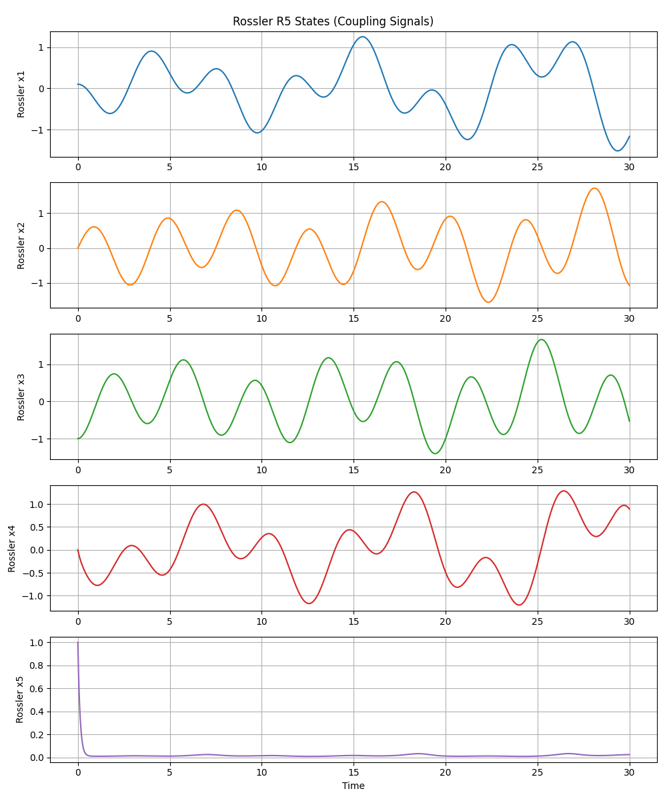
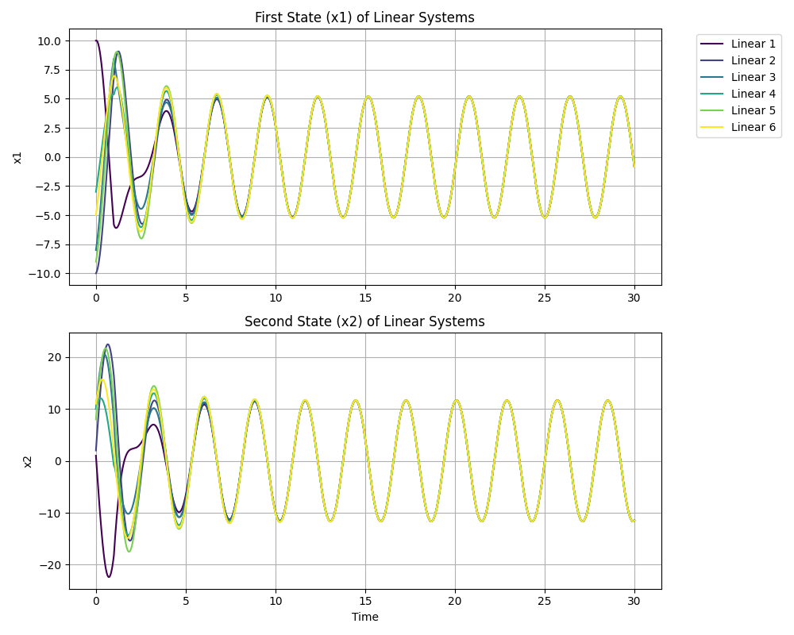

# Simulation of Chaotic Couplings in Linear Systems

[](https://www.python.org/)
[](https://opensource.org/licenses/MIT)
[](https://www.mathworks.com/products/simulink.html)

This project simulates a complex network of linear systems connected via chaotic couplings derived from a Generalized Rossler System in $R^5$.


## Overview

The simulation consists of:
1.  **Generalized Rossler System**: A hyperchaotic system in 5 dimensions.
2.  **Linear Oscillators**: 6 harmonic oscillators with different initial conditions.
3.  **Chaotic Coupling**: The linear systems are coupled using signals from the Rossler system, creating complex dynamics.

## Python Simulation (New)

A Python implementation is now available, replicating the Simulink model using `scipy.integrate`.

### Prerequisites
Install the required packages:
```bash
pip install -r requirements.txt
```

### Running the Simulation
Execute the simulation script:
```bash
python3 python_simulation.py
```
This will solve the differential equations and generate two plots:
-   `py_rossler_states.png`: The chaotic states of the Rossler system.
-   `py_linear_systems_states.png`: The states of the 6 linear oscillators.

## MATLAB / Simulink Simulation

### Preparation
Modify parameters in the `param_Ross.m` file.
-   **Rossler Parameters**: Control the chaotic system dynamics.
-   **Network Parameters**:
    -   `K`: Coupling Constant.
    -   `ofs`: Offset for chaotic signals.
    -   `amp`: Amplitude of the chaotic signals.
    -   Default: $K=1, ext{ofs}=1, ext{amp}=0.2$.

### Running
1.  Run `param_Ross.m` to load parameters into the workspace.
2.  Open and run `red6Rossler.mdl` in Simulink.
3.  Run `graph.m` to plot the results.

### Notable Components in Simulink
-   **Connection Timer**: A step block enabling coupling after a set time.
-   **Linear# Subsystems**: Harmonic oscillators.
-   **RosslerR5**: The generalized Rossler system.
-   **Fcn Blocks**: Define the coupling logic based on the network structure.

## Scientific Background

### Generalized Rossler System
The core of this simulation is the **Generalized Rössler System** in $N=5$ dimensions, proposed by Meyer et al. (1997). Unlike the classic 3D Rössler system which exhibits simple chaos (one positive Lyapunov exponent), higher-dimensional variants can exhibit **hyperchaos** (multiple positive Lyapunov exponents). This makes the system's dynamics even more unpredictable and complex, suitable for secure communications and advanced synchronization studies.

The state equations for the $R^5$ system are:
$$
\begin{aligned}
\dot{x}_1 &= a x_1 - x_2 \\
\dot{x}_2 &= x_1 - x_3 \\
\dot{x}_3 &= x_2 - x_4 \\
\dot{x}_4 &= x_3 - x_5 \\
\dot{x}_5 &= \epsilon + b x_5 (x_4 - d)
\end{aligned}
$$

### Network Synchronization
The simulation explores a network of 6 **Linear Oscillators** coupled to this hyperchaotic driver. The coupling is not merely a broadcast; the linear systems are also coupled to *each other* (e.g., System 1 is coupled to System 3). This topology represents a complex network where a hyperchaotic "pinner" or driver influences the collective behavior of a linear array.
Such setups are often used to study:
- **Synchronization**: How differing systems align their trajectories over time.
- **Control**: Using chaos to steer linear systems.
- **Complex Networks**: Dynamics of nodes with specific connectivity topologies.

## Simulation Results

The following results were generated using the Python simulation (`python_simulation.py`).

### 1. Rossler Hyperchaotic States
The 5 state variables of the driver system. Note the complex, non-periodic oscillations characteristic of hyperchaos.


### 2. Linear System Response
The 6 linear oscillators, starting from different initial conditions, are modulated by the chaotic signal beginning at $t=1$.


## References & Resources

1.  **Primary Paper**: Meyer, Th., Bunner, M. J., Kittel, A., & Parisi, J. (1997). [Hyperchaos in the generalized Rössler system](https://journals.aps.org/pre/abstract/10.1103/PhysRevE.56.5069). *Physical Review E*, 56(5), 5069.
2.  **Rössler Attractor**: [Wikipedia - Rössler Attractor](https://en.wikipedia.org/wiki/R%C3%B6ssler_attractor).
3.  **Chaos Synchronization**: Pecora, L. M., & Carroll, T. L. (1990). Synchronization in chaotic systems. *Physical Review Letters*, 64(8), 821.
